# Emily's Modifier Dictionary 

## Design

This dictionary was created with the following goals in mind:

- Have a consistent method to type (pretty much) every shortcut 
- Do it all in only one stroke
- Hackable and understandable to anyone who finds it useful :)

## Section

To achieve this, for each stroke there are 4 main sections:
1. Character (Purple)
2. Switcher (Orange)
3. Modifiers (Green)
4. Unique ending (Red)

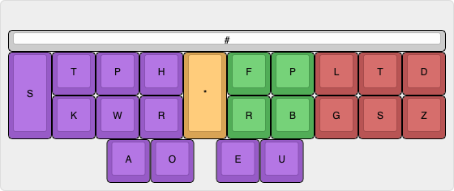

### Unique Ending

Due to fingerspelling existing on the left hand, a unique chord with the right hand must be stroked.
This stroke is used to uniquely identify a dictionary entry chord from any other chord.
By default this is `-LTZ`, this should be stroked with pinky on the `-Z` and ring finger for `-LT`.
Due to physical and practical limitations, this key combination is both difficult to press, and also will generate clashes. 
Please check with your dictionary to see what clashes may occur, and potentially change what this stroke is.
With Magnum as I currently use it, the `-LTZ` stroke clashes with only 71 entries, most of which are misstroke entries, so I don't have to worry about it too much. 

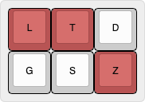

### Modifiers 

`FRPB` are used to specify the modifier keys to be used against the selected character. 
These can all be used in any variation to produced the desired shortcut.  

| modifier pattern                            | modifier  |
|---------------------------------------------|-----------|
| 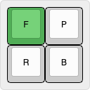 | `control` |
| 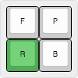     | `shift`   |
| 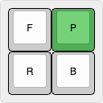     | `super`   |
| 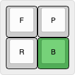         | `alt`     |

### Character

Character input is based on fingerspelling and takes up the whole left hand and vowels.
Valid fingerspelling entries contain methods from multiple steno theories, hence why there are duplicate entries for some.

| fingerspelling pattern                | letter  |
|---------------------------------------|---------|
| 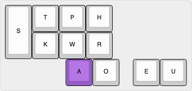        | `A`     |
| 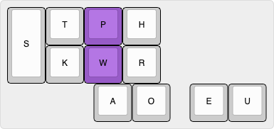        | `B`     |
| 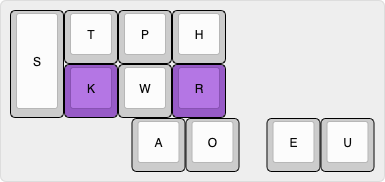        | `C`     |
| 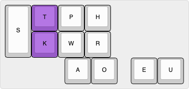        | `D`     |
| 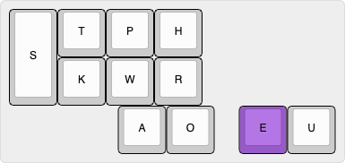        | `E`     |
| 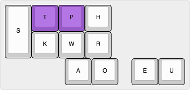        | `F`     |
| 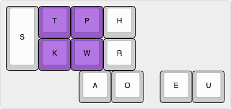        | `G`     |
| 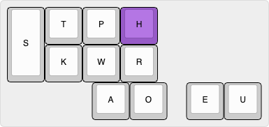        | `H`     |
| 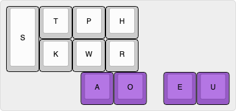        | `I`     |
| 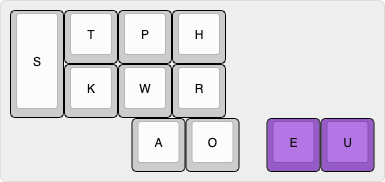      | `I`     |
| 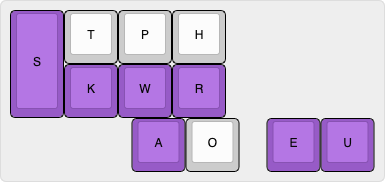        | `J`     |
| 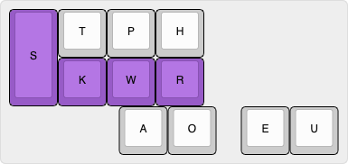      | `J`     |
| 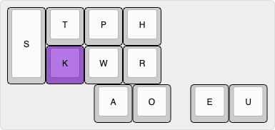        | `K`     |
| 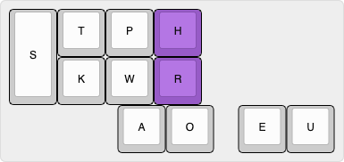        | `L`     |
| 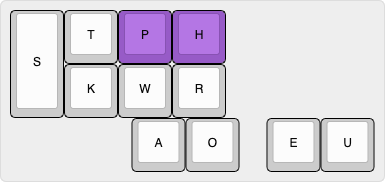        | `M`     |
| 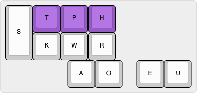        | `N`     |
| 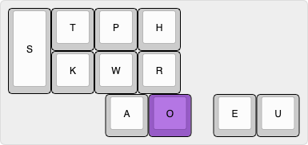        | `O`     |
| 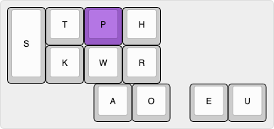        | `P`     |
| 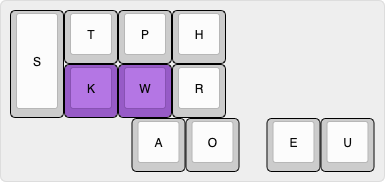        | `Q`     |
| 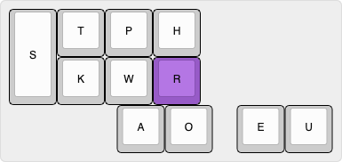        | `R`     |
| 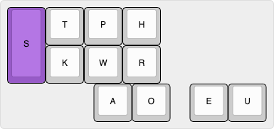        | `S`     |
| 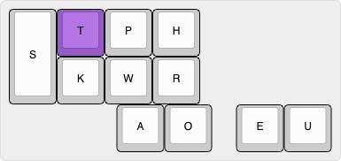        | `T`     |
| 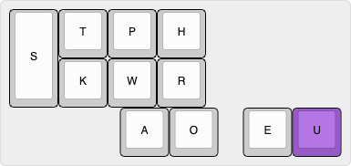        | `U`     |
| 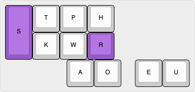        | `V`     |
|         | `W`     |
| 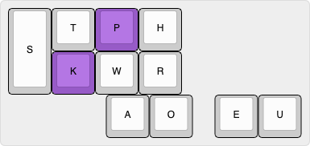        | `X`     |
| 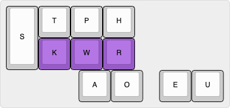        | `Y`     |
| 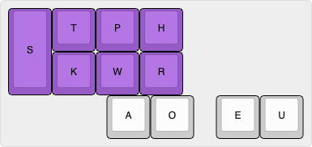        | `Z`     |
| 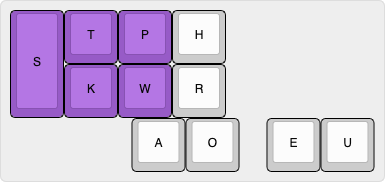      | `Z`     |

When `AO` is held, as that's not valid fingerspelling, the bottom row of the left hand (`SKWR`) will turn into binary number input from 0 to 9.

| binary number pattern                 | number  |
|---------------------------------------|---------|
| 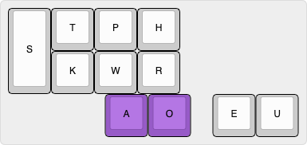        | `0`     |
| 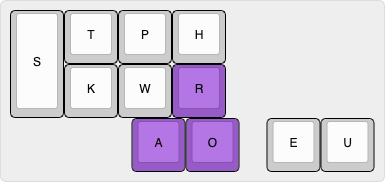        | `1`     |
| 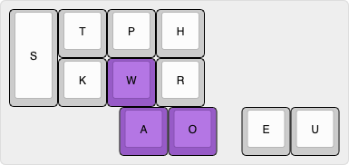        | `2`     |
| 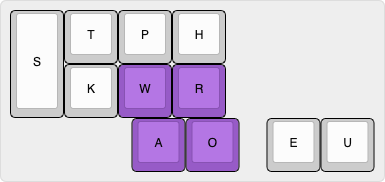        | `3`     |
| 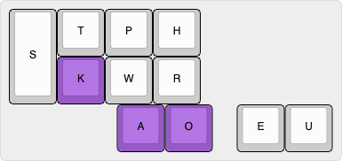        | `4`     |
| 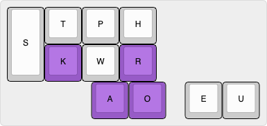        | `5`     |
| 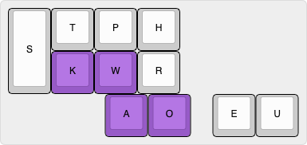        | `6`     |
| 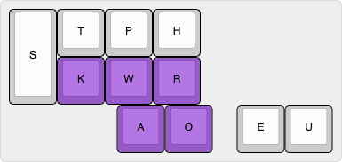        | `7`     |
| 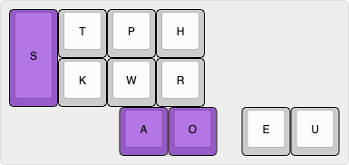        | `8`     |
| 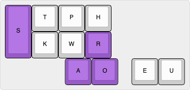        | `9`     |

If `TP` (`F`) is also held, the number input will specify function number keys.

| binary function number pattern | function |
|--------------------------------|----------|
| 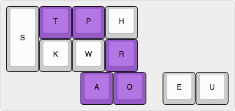      | `F1`     |
| 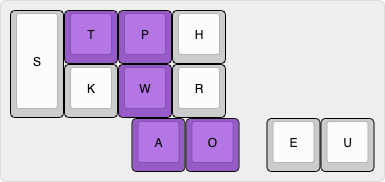      | `F2`     |
| 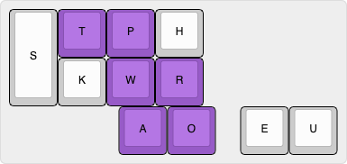      | `F3`     |
| 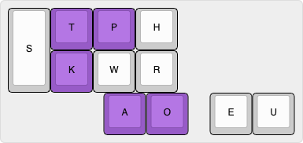      | `F4`     |
| 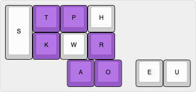      | `F5`     |
|       | `F6`     |
| 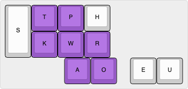      | `F7`     |
|       | `F8`     |
|       | `F9`     |
|     | `F10`    |
|     | `F11`    |
|     | `F12`    |

### Switcher

When `*` is used, the left bank will switch from fingerspelling letters, to a reflected and modified symbol dictionary. 
This will allow you to apply modifiers to symbols.
However, please note:
> Due to the way plover can operate and the way computers receive shortcut keys, when specifying a symbol, you only specify the key it is mapped to in the current keymap. This means that if the symbol is under shift, then you still need to use the shift modifier. For example, `control+shift+1` is not the same as `control+!`, you still need to add in the `shift` modifier.

Additionally, while using the switcher for symbol specification, the `A` and `O` keys are used to specify variants of a particular symbol, similar to the emily-symbols dictionary.`A` represents adding 1, while `O` represents adding 2 to the entries below.

 | symbol pattern                                 | output | name |
 |------------------------------------------------|--------|------|
 |           | `tab`, `backspace`, `delete`, `escape` | `tab`, `backspace`, `delete`, `escape` |
 |  | `up`, `left`, `right`, `down` | `up`, `left`, `right`, `down` |
 |  | `pageup`, `home`, `end`, `pagedown` | `pageup`, `home`, `end`, `pagedown` |
 |  | `escape`, `tab`, `return`, ` ` | `escape`, `tab`, `return`, `space` |
 |  | `!`, , `¬`, `¡` | `exclam`, , `notsign`, `exclamdown` |
 |  | `"`, , ,  | `quotedbl`, , ,  |
 |  | `#`, `®`, `©`,  | `numbersign`, `registered`, `copyright`,  |
 |  | `$`, `€`, `¥`, `£` | `dollar`, `euro`, `yen`, `sterling` |
 |  | `%`, , ,  | `percent`, , ,  |
 |  | `'`, , , | `apostrophe`, , , |
 |  | `&`, , ,  | `ampersand`, , ,  |
 |  | `(`, `<`, `[`, `{` | `parenleft`, `less`, `bracketleft`, `braceleft` |
 |  | `)`, `>`, `]`, `}` | `parenright`, `greater`, `bracketright`, `braceright` |
 |  | `*`, `§`, , `×` | `asterisk`, `section`, , `multiply` |
 |  | `+`, `¶`, , `±` | `plus`, `paragraph`, , `plusminus` |
 |  | `,`, , ,  | `comma`, , ,  |
 |  | `-`, , ,  | `minus`, , ,  |
 |  | `.`, `·`, ,  | `period`, `periodcentered`, ,  |
 |  | `/`, , , `÷` | `slash`, , , `division` |
 |  | `:`, , ,  | `colon`, , ,  |
 |  | `;`, , ,  | `semicolon`, , ,  |
 |  | `=`, , ,  | `equal`, , ,  |
 |  | `?`, , `¿`,  | `question`, , `questiondown`,  |
 |  | `@`, , ,  | `at`, , ,  |
 |  | `\`, , ,  | `backslash`, , ,  |
 |  | `^`, `«`, `»`, `°` | `asciicircum`, `guillemotleft`, `guillemotright`, `degree` |
 |  |  `` ` ``, , ,  | `grave`, , ,  |
 |  | `|`, , , `¦` | `bar`, , , `brokenbar` |
 |  | `~`, , ,  | `asciitilde`, , ,  |

## A few favourites

This is a list of a few shortcuts I use often so you can see how it all comes together. :)
| Chord | Use |
|-------|-----|
|  | press `cmd+space` to activate spotlight search on my mac |
|  | press `control+right` to move over a desktop on my mac |
|  | press `control+c` to interrupt a running program when programming |
|  | press `control+\` to stop a running program when programming |

## Poster

Check out the summary poster made by @sammdot for a nice one-page overview of how the whole dictionary works!
[emily-modifiers-poster](emily-modifiers-poster.pdf)
